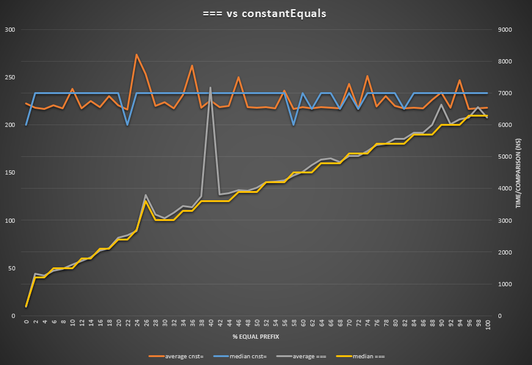

# Constant Equals

[Timing attacks](http://codahale.com/a-lesson-in-timing-attacks/) are a real threat. A very common pitfall is to compare strings with `===`.

## Why?
Simply because `a === b` will take more time to execute if they share a bigger prefix. So checking the user input against a target password with `===` will leak how much the attacker got the password right.

Don't believe, so see:


You can run [the code](bench.js) yourself.

## The solution
Make a for that checks every character. Don't try to be smart here :)

## Install
`npm install constant-equals --save`

## Usage
```javascript
var a = 'a-user-input',
	g = 'target-password',
	eq = require('constant-equals')
if (eq(a, b)) {
	console.log('Welcome')
} else {
	console.log('Go away!')
}
```
